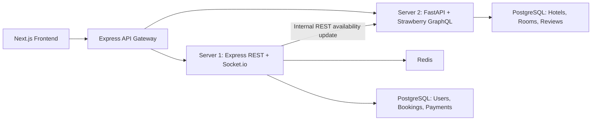

# HotelHub Brief Document

## 1. Project Information

| Field | Details |
|---|---|
| Project name | HotelHub |
| Project type | Fullstack microservices hotel booking platform |
| Student submission evidence | Working application, source code/repository, deployment instructions, API documentation, testing documentation, security report, evaluation |
| GitHub repository | https://github.com/tyunta-21/HotelHub |
| Main technologies | Next.js, TanStack Query, Zustand, Express, Socket.io, FastAPI, Strawberry GraphQL, Prisma, SQLAlchemy, PostgreSQL, Redis, Docker |
| Main user roles | Guest, registered user, admin |

## 2. Brief Interpretation

Two assignment briefs were reviewed:

| Brief | Unit | Main expectation | HotelHub response |
|---|---:|---|---|
| API Implementation, Testing and Security Evaluation | Unit 37: Application Program Interfaces | Implement an application with API integration, structured/functional testing, API security review, and evaluation of APIs used. | HotelHub uses REST, GraphQL, internal REST microservice communication, Socket.io events, JWT auth, Redis sessions, and Dockerized services. |
| Development, Testing, Deployment and Evaluation of a Business Application | Unit 36: Application Development | Build a functional business application from requirements, document design/development/testing/deployment, and evaluate against requirements. | HotelHub solves hotel booking management with user booking, admin management, room availability updates, and deployment through Docker Compose. |

## 3. Business Problem

Hotel booking systems often need to manage hotel catalog data, room availability, user authentication, bookings, payments, and administrative controls. A single monolithic application can become difficult to maintain because catalog data, booking transactions, authentication, and real-time notifications have different responsibilities and performance requirements.

HotelHub solves this business problem by separating the system into microservices:

- a frontend for users and administrators;
- a REST booking/auth service;
- a GraphQL hotel catalog service;
- an API gateway;
- separate PostgreSQL databases for booking and catalog domains;
- Redis for sessions and room availability caching;
- Socket.io for real-time booking notifications.

## 4. Proposed Solution

HotelHub is a microservices hotel booking platform where users can browse hotels, view rooms, register/login, create bookings, cancel/delete their bookings, and receive real-time booking notifications. Admin users can view all bookings, update booking status, cancel bookings, and delete bookings.

The application follows a service separation approach:

| Layer | Service | Responsibility |
|---|---|---|
| Client | `frontend` | Next.js UI, state management, REST/GraphQL calls, realtime notifications |
| Gateway | `gateway` | Single public entry point, CORS, REST and GraphQL routing |
| Booking service | `server1` | JWT auth, bookings, payments, Socket.io, Prisma, Redis |
| Catalog service | `server2` | Hotels, rooms, reviews, room availability, GraphQL API, SQLAlchemy |
| Data stores | `postgres_server1`, `postgres_server2`, `redis` | Persistent and cache/session storage |

## 5. Initial Requirements

### 5.1 Functional Requirements

| ID | Requirement | Implementation evidence |
|---|---|---|
| FR1 | Users can register and login. | `POST /auth/register` and `POST /auth/login` in `server1/src/index.js`. |
| FR2 | Auth uses access and refresh tokens. | `signTokens()` creates both access and refresh tokens in `server1/src/index.js`. |
| FR3 | Users can browse hotel catalog. | `hotels()` GraphQL query in `server2/app/schema.py`; frontend calls `/graphql`. |
| FR4 | Users can view hotel detail, rooms, and reviews. | `hotel`, `rooms`, and `reviews` GraphQL queries in `server2/app/schema.py`. |
| FR5 | Users can create bookings. | `POST /bookings` in `server1/src/index.js`. |
| FR6 | Users can view their bookings. | `GET /bookings/:userId` in `server1/src/index.js`. |
| FR7 | Users can cancel or permanently delete their bookings. | `DELETE /bookings/:id` and `DELETE /bookings/:id/permanent`. |
| FR8 | Admin can view and manage all bookings. | `GET /bookings`, `PATCH /bookings/:id`, delete endpoints with admin role checks. |
| FR9 | Room availability is updated after booking/cancellation. | Server 1 calls Server 2 internal endpoint after booking changes. |
| FR10 | Users receive real-time booking notifications. | Socket.io events emitted by Server 1 and consumed in `frontend/components/Providers.tsx`. |
| FR11 | Mock payments are processed. | `POST /payments` in `server1/src/index.js`. |

### 5.2 Non-Functional Requirements

| ID | Requirement | Implementation evidence |
|---|---|---|
| NFR1 | Application must be deployable. | `docker-compose.yml` starts all services and databases. |
| NFR2 | Services should be separated by responsibility. | Separate `frontend`, `gateway`, `server1`, `server2` directories. |
| NFR3 | APIs should use structured validation. | Server 1 uses `zod` validation for auth/bookings/payments. |
| NFR4 | Authentication should protect booking endpoints. | `requireAuth()` middleware protects sensitive REST endpoints. |
| NFR5 | Catalog API should support flexible queries. | Strawberry GraphQL supports selecting only required fields. |
| NFR6 | The application should be testable. | Health endpoints, REST endpoints, GraphQL endpoint, Docker Compose deployment. |

## 6. Development Methodology

The project was developed using an iterative methodology. The main phases were:

| Phase | Activity | Outcome |
|---|---|---|
| Planning | Identify business problem and microservice boundaries. | HotelHub architecture selected. |
| Design | Define frontend pages, APIs, database models, and deployment plan. | REST + GraphQL + Socket.io design. |
| Implementation | Build services and frontend pages. | Working Dockerized system. |
| Testing | Run Docker, health checks, frontend build, API calls, manual user flows. | Defects fixed, including GraphQL proxy and UI alignment. |
| Review | Evaluate performance, security, and future improvements. | Security and evaluation sections documented. |

This methodology is suitable because the project required fast feedback from running services. Bugs found during testing, such as GraphQL gateway path routing and UI alignment of hotel cards, were corrected during implementation.

## 7. Tools and Techniques

| Tool/technology | Purpose | Justification |
|---|---|---|
| Next.js | Frontend application | Supports routing, React components, and modern UI development. |
| TanStack Query | Data fetching | Provides caching, loading states, and mutation management. |
| Zustand | Client state | Lightweight global auth and booking state. |
| Express | API Gateway and Server 1 | Fast REST development and middleware support. |
| Socket.io | Realtime events | Booking confirmations can be pushed to connected clients. |
| FastAPI | Server 2 | Python web framework suitable for API services. |
| Strawberry GraphQL | Catalog API | Allows flexible hotel/room/review queries. |
| Prisma ORM | Server 1 database | Strong schema for users, bookings, payments. |
| SQLAlchemy | Server 2 database | Python ORM for catalog entities. |
| PostgreSQL | Persistent storage | Reliable relational database for both services. |
| Redis | Sessions and availability cache | Fast key-value storage for JWT sessions and room availability. |
| Docker Compose | Deployment | Runs all services consistently with one command. |

## 8. Architecture Design

### 8.1 Service Architecture



### 8.2 Docker Deployment

The deployment is defined in `docker-compose.yml`. It includes:

- frontend on port `3000`;
- gateway on port `8080`;
- server1 on port `4001`;
- server2 on port `4002`;
- booking PostgreSQL on host port `5433`;
- catalog PostgreSQL on host port `5434`;
- Redis on port `6379`.

Example from `docker-compose.yml`:

```yaml
server1:
  build: ./server1
  container_name: hotelhub-server1
  ports:
    - "4001:4001"
  depends_on:
    postgres_server1:
      condition: service_healthy
    redis:
      condition: service_healthy
    server2:
      condition: service_started
```

This shows that Server 1 only starts after PostgreSQL and Redis are healthy, reducing startup errors.

## 9. API Design

### 9.1 API Gateway

The API gateway exposes a single public entry point and routes requests to the correct service.

| Public path | Target service | Purpose |
|---|---|---|
| `/api/v1/*` | Server 1 | Auth, bookings, payments |
| `/graphql` | Server 2 | Hotels, rooms, reviews |
| `/socket.io` | Server 1 | Real-time booking events |

Example from `gateway/index.js`:

```js
app.use(
  "/api/v1",
  createProxyMiddleware({
    target: server1Url,
    changeOrigin: true,
    ws: true
  })
);
```

The gateway also handles CORS:

```js
app.use(
  cors({
    origin: clientOrigin,
    credentials: true,
    methods: ["GET", "POST", "PATCH", "DELETE", "OPTIONS"],
    allowedHeaders: ["Content-Type", "Authorization"]
  })
);
```

### 9.2 REST API: Server 1

| Method | Endpoint | Description | Auth required |
|---|---|---|---|
| POST | `/auth/register` | Register a user | No |
| POST | `/auth/login` | Login and receive tokens | No |
| POST | `/auth/refresh` | Refresh access token | Refresh token |
| POST | `/bookings` | Create booking | Yes |
| GET | `/bookings/:userId` | Get user bookings | Yes |
| GET | `/bookings` | Admin get all bookings | Admin |
| PATCH | `/bookings/:id` | Update booking status | Owner/admin |
| DELETE | `/bookings/:id` | Cancel booking | Owner/admin |
| DELETE | `/bookings/:id/permanent` | Permanently delete booking | Owner/admin |
| POST | `/payments` | Mock payment | Yes |

Example authentication code from `server1/src/index.js`:

```js
function requireAuth(req, res, next) {
  const token = req.headers.authorization?.replace("Bearer ", "");
  if (!token) return res.status(401).json({ message: "Missing bearer token" });

  try {
    req.user = jwt.verify(token, accessSecret);
    return next();
  } catch {
    return res.status(401).json({ message: "Invalid or expired access token" });
  }
}
```

Example booking creation:

```js
const booking = await prisma.booking.create({
  data: {
    ...data,
    checkIn: new Date(data.checkIn),
    checkOut: new Date(data.checkOut),
    totalAmount: data.totalAmount,
    status: "CONFIRMED"
  }
});
```

After booking creation, Server 1 updates Redis, calls Server 2, and emits a Socket.io event:

```js
await redis.set(`room:${data.roomId}:available`, "false", "EX", 60 * 15);
await axios.post(process.env.SERVER2_INTERNAL_URL, {
  roomId: data.roomId,
  isAvailable: false
});
io.to(`user:${data.userId}`).emit("booking:confirmed", booking);
```

### 9.3 GraphQL API: Server 2

| Type | Operation | Purpose |
|---|---|---|
| Query | `hotels(filter, search, limit, offset)` | List hotels |
| Query | `hotel(id)` | Get single hotel |
| Query | `rooms(hotelId)` | Get rooms for hotel |
| Query | `room(id)` | Get single room |
| Query | `reviews(hotelId)` | Get hotel reviews |
| Mutation | `addReview(hotelId, rating, comment)` | Add review |
| Mutation | `updateRoomAvailability(roomId, isAvailable)` | Update availability |

Example from `server2/app/schema.py`:

```python
@strawberry.field
def hotels(
    self,
    filter: Optional[str] = None,
    search: Optional[str] = None,
    limit: int = 20,
    offset: int = 0,
) -> list[Hotel]:
    db = SessionLocal()
    try:
        query = db.query(HotelModel)
        if filter:
            query = query.filter(or_(HotelModel.city.ilike(f"%{filter}%"), HotelModel.country.ilike(f"%{filter}%")))
        if search:
            query = query.filter(or_(HotelModel.name.ilike(f"%{search}%"), HotelModel.description.ilike(f"%{search}%")))
        return [to_hotel(hotel) for hotel in query.offset(offset).limit(limit).all()]
    finally:
        db.close()
```

### 9.4 Frontend API Integration

REST requests are centralized in `frontend/lib/rest.ts`:

```ts
async function request<T>(path: string, options: RequestInit = {}, token?: string): Promise<T> {
  const response = await fetch(`${gatewayUrl}/api/v1${path}`, {
    ...options,
    headers: {
      "Content-Type": "application/json",
      ...(token ? { Authorization: `Bearer ${token}` } : {}),
      ...options.headers
    }
  });
  const payload = await response.json();
  if (!response.ok) throw new Error(payload.message || "REST request failed");
  return payload;
}
```

GraphQL requests are centralized in `frontend/lib/graphql.ts`:

```ts
export async function graphQL<T>(query: string, variables?: Record<string, unknown>): Promise<T> {
  const response = await fetch(`${gatewayUrl}/graphql`, {
    method: "POST",
    headers: { "Content-Type": "application/json" },
    body: JSON.stringify({ query, variables })
  });
  const payload = await response.json();
  if (!response.ok || payload.errors) {
    throw new Error(payload.errors?.[0]?.message || "GraphQL request failed");
  }
  return payload.data;
}
```

Socket.io notifications are handled in `frontend/components/Providers.tsx`:

```tsx
socket.on("booking:confirmed", (booking) => setNotice(`Booking confirmed for ${booking.roomName}`));
socket.on("booking:updated", (booking) => setNotice(`Booking status updated to ${booking.status}`));
socket.on("booking:cancelled", (booking) => setNotice(`Booking cancelled for ${booking.roomName}`));
```

## 10. Database Design

### 10.1 Server 1: Booking Database

Server 1 uses Prisma and PostgreSQL.

| Model | Main fields | Purpose |
|---|---|---|
| User | `id`, `name`, `email`, `passwordHash`, `role` | Stores registered users and admins |
| Booking | `userId`, `hotelId`, `roomId`, `checkIn`, `checkOut`, `status` | Stores hotel room bookings |
| Payment | `bookingId`, `amount`, `provider`, `status` | Stores mock payment records |

Example from `server1/prisma/schema.prisma`:

```prisma
model Booking {
  id          String        @id @default(uuid())
  userId      String
  hotelId     String
  hotelName   String
  roomId      String
  roomName    String
  checkIn     DateTime
  checkOut    DateTime
  guests      Int
  totalAmount Decimal       @db.Decimal(10, 2)
  status      BookingStatus @default(PENDING)
  user        User          @relation(fields: [userId], references: [id], onDelete: Cascade)
  payment     Payment?
}
```

### 10.2 Server 2: Catalog Database

Server 2 uses SQLAlchemy and PostgreSQL.

| Model | Main fields | Purpose |
|---|---|---|
| Hotel | `id`, `name`, `city`, `country`, `description`, `rating` | Stores hotel catalog |
| Room | `hotel_id`, `name`, `price_per_night`, `capacity` | Stores rooms |
| Review | `hotel_id`, `guest_name`, `rating`, `comment` | Stores reviews |
| RoomAvailability | `room_id`, `is_available` | Tracks room availability |

## 11. User Interface

| Page | Route | Purpose |
|---|---|---|
| Home | `/` | Landing page and entry point |
| Hotel Catalog | `/hotels` | Displays all seeded hotels |
| Hotel Detail | `/hotels/[id]` | Shows hotel, rooms, reviews |
| Room Detail | `/rooms/[id]?hotelId=...` | Shows room and booking form |
| Login/Register | `/auth` | User authentication |
| My Bookings | `/bookings` | User booking management |
| Admin Dashboard | `/admin` | Admin booking management |

Recent UI refinements:

- Hotel cards use equal-height layout so `View rooms` buttons align.
- Booking form defaults `Check in` to today and `Check out` to tomorrow.
- Users have both `Cancel` and `Delete` actions for bookings.

## 12. Testing Documentation

### 12.1 Structural Tests

| Test ID | Test type | What was tested | Expected result | Result |
|---|---|---|---|---|
| ST1 | Docker config | `docker compose config` | Compose file validates | Passed |
| ST2 | Python syntax | `python3 -m compileall server2/app` | Server 2 syntax valid | Passed |
| ST3 | Node syntax | `node --check server1/src/index.js` | Server 1 syntax valid | Passed |
| ST4 | Next build | `docker compose exec frontend npm run build` | Frontend builds successfully | Passed |
| ST5 | Service health | `/health` endpoints | Services return `ok: true` | Passed |

### 12.2 Functional Tests

| Test ID | User action | Expected result | Actual result |
|---|---|---|---|
| FT1 | Open `/hotels` | 5 hotels appear | Passed |
| FT2 | Click `View rooms` | Hotel detail page opens | Passed |
| FT3 | Open room detail | Room data and booking form appear | Passed |
| FT4 | Login as `user@hotelhub.local` | User session starts and navbar shows user | Passed |
| FT5 | Create booking | Booking appears in My Bookings with `CONFIRMED` status | Passed |
| FT6 | Cancel booking | Booking remains but status becomes `CANCELLED` | Passed |
| FT7 | Delete booking | Booking disappears from list | Passed |
| FT8 | Login as admin | Admin dashboard opens | Passed |
| FT9 | Admin deletes user booking | Booking removed from database/list | Passed |
| FT10 | GraphQL hotels query | Catalog returns hotel data | Passed |
| FT11 | REST login through gateway | Access and refresh tokens returned | Passed |

### 12.3 Example API Test Commands

Health checks:

```bash
curl http://localhost:8080/health
curl http://localhost:4001/health
curl http://localhost:4002/health
```

GraphQL catalog test:

```bash
curl -X POST http://localhost:8080/graphql \
  -H "Content-Type: application/json" \
  -d '{"query":"query { hotels(limit: 2, offset: 0) { id name city } }"}'
```

REST login test:

```bash
curl -X POST http://localhost:8080/api/v1/auth/login \
  -H "Content-Type: application/json" \
  -d '{"email":"user@hotelhub.local","password":"user123"}'
```

## 13. Security Findings and Vulnerability Report

| Area | Current implementation | Risk | Recommendation |
|---|---|---|---|
| Password storage | Passwords are hashed with bcrypt. | Low risk if secrets are protected. | Keep bcrypt and never store raw passwords. |
| JWT access tokens | Access tokens are signed and verified. | Token theft could allow account access. | Use HTTPS in production and short token lifetimes. |
| Refresh sessions | Refresh token stored in Redis. | Redis exposure would affect sessions. | Protect Redis network access and use strong secrets. |
| Authorization | Owner/admin checks protect booking access. | Missing checks could expose bookings. | Keep tests for owner/admin access rules. |
| CORS | Gateway allows configured client origin. | Wide CORS in production would be unsafe. | Set exact production origin. |
| Environment secrets | `.env.example` contains sample secrets. | Real secrets must not be committed. | Use real `.env` locally/production and keep it ignored. |
| Internal API | Server 1 calls Server 2 internal availability endpoint. | Endpoint could be called directly if exposed. | Restrict internal routes in production network. |
| Mock payment | Payment endpoint is simulated. | Not suitable for real card processing. | Integrate a PCI-compliant provider for production. |

Security design examples:

- `requireAuth()` rejects missing or invalid bearer tokens.
- Booking update/delete checks compare `booking.userId` with `req.user.sub` unless user role is `ADMIN`.
- Passwords are hashed using `bcrypt.hash()`.
- Refresh sessions are stored in Redis with expiration.

## 14. Evaluation of APIs Used

| API type | Used for | Strengths | Weaknesses |
|---|---|---|---|
| REST | Auth, bookings, payments | Simple, predictable, easy to test with curl/Postman | Can over-fetch/under-fetch if many related resources are needed |
| GraphQL | Hotels, rooms, reviews | Flexible client queries and good for catalog browsing | Requires schema design and careful query performance control |
| Internal REST | Server 1 to Server 2 room availability | Simple microservice communication | Needs network/security restrictions in production |
| Socket.io | Real-time booking notifications | Immediate user feedback | Requires persistent connections and scaling strategy |

The combination is justified because different domains benefit from different API styles. Booking actions are transactional and suit REST. Catalog browsing benefits from GraphQL flexibility. Realtime booking confirmation suits Socket.io.

## 15. Performance Evaluation

| Factor | Current approach | Effect |
|---|---|---|
| Service separation | Booking and catalog split into two services | Reduces coupling and allows independent scaling |
| Redis cache | Room availability cached for fast access | Reduces repeated database checks |
| TanStack Query | Frontend caches API results | Improves perceived performance |
| Docker health checks | Services wait for databases | Reduces startup failures |
| PostgreSQL indexes | Booking indexed by `userId` and `roomId` | Improves lookup performance |

Potential performance improvements:

- add pagination UI for bookings and hotels;
- add GraphQL query complexity limits;
- add Redis cache invalidation rules beyond short TTL;
- use production Next.js build instead of dev command in production Docker;
- add load testing for booking creation.

## 16. Risk Review

| Risk | Impact | Mitigation |
|---|---|---|
| Microservice startup order issues | Services fail at startup | Docker health checks added for databases/Redis |
| API route mismatch | Frontend cannot reach services | Gateway path rewrite fixed for `/graphql` |
| Unauthorized booking access | Privacy/security issue | Owner/admin checks implemented |
| Room availability inconsistency | Double booking or wrong UI status | Redis cache and Server 2 availability update |
| Network dependency during build | Slow builds or package timeout | Reduced heavy Python dependencies and added pip timeout/retries |
| UI inconsistency | Poor user experience | Card layout and date defaults fixed |

## 17. Deployment Instructions

### 17.1 Prerequisites

- Docker Desktop installed and running.
- Git installed.
- Ports `3000`, `4001`, `4002`, `5433`, `5434`, `6379`, and `8080` available.

### 17.2 Run Locally

```bash
git clone https://github.com/tyunta-21/HotelHub.git
cd HotelHub
docker compose up --build
```

Open:

- Frontend: http://localhost:3000
- Gateway: http://localhost:8080
- Server 1 health: http://localhost:4001/health
- Server 2 GraphQL: http://localhost:4002/graphql

### 17.3 Demo Accounts

| Role | Email | Password |
|---|---|---|
| User | `user@hotelhub.local` | `user123` |
| Admin | `admin@hotelhub.local` | `admin123` |

## 18. User Guide

### 18.1 Browse Hotels

1. Open http://localhost:3000.
2. Click `Browse hotels` or `Hotels`.
3. Review hotel cards.
4. Click `View rooms`.

### 18.2 Book a Room

1. Login or register.
2. Open a hotel.
3. Select a room.
4. The booking form automatically fills:
   - check-in: today;
   - check-out: tomorrow.
5. Select guests.
6. Click `Confirm booking`.
7. View the booking in `My Bookings`.

### 18.3 Manage Bookings

| Action | Result |
|---|---|
| Cancel | Booking status becomes `CANCELLED`; record stays visible |
| Delete | Booking is permanently removed |

### 18.4 Admin Dashboard

1. Login as admin.
2. Open `/admin`.
3. View all bookings.
4. Use `Mark completed`, `Cancel`, or `Delete`.

## 19. Review Against Brief Criteria

### 19.1 Unit 37: Application Program Interfaces

| Criterion | Evidence in HotelHub |
|---|---|
| P1 API and SDK relationship | The project uses APIs directly through REST, GraphQL, and Socket.io client libraries; SDK-like libraries simplify API consumption. |
| P2 Existing application extended with APIs | HotelHub is structured around API-driven frontend/backend communication. |
| P3 Build on framework to implement API | Express and FastAPI frameworks implement REST and GraphQL APIs. |
| P4 White box testing | Code-level checks include syntax validation, build, route review, auth/role logic review. |
| M1 Range of APIs | REST, GraphQL, Socket.io, and internal REST are used for different purposes. |
| M2 API application design | The architecture separates catalog and booking services and connects through a gateway. |
| M3 API-utilising application | Frontend consumes REST and GraphQL; Server 1 consumes Server 2 internal API. |
| M4 Black box tests | Manual browser and curl tests verified user flows and API responses. |
| M5 Updates from testing | Gateway `/graphql`, UI alignment, booking delete, and default dates were fixed after testing. |
| D1 API security issues | JWT, CORS, Redis sessions, authorization risks documented. |
| D2 Substantial app design | Full microservices architecture documented and implemented. |
| D3 Multiple APIs | REST, GraphQL, Socket.io, internal REST implemented. |
| D4 API evaluation/security report | API evaluation and security report included in this document. |

### 19.2 Unit 36: Application Development

| Criterion | Evidence in HotelHub |
|---|---|
| P1 Problem definition and requirements | Business problem, functional requirements, and non-functional requirements documented. |
| P2 Risk areas | Risk review table included. |
| P3 Tools and techniques | Tools table explains selected technologies. |
| P4 Presentation/peer review | The project can be presented using the architecture, testing, and evaluation sections. |
| P5 Functional business application | Dockerized application runs with booking, catalog, auth, admin, and notifications. |
| P6 Review performance against requirements | Performance and requirement evaluation included. |
| M1 Software Design Document | This document contains requirements, analysis, design, coding evidence, testing, and deployment. |
| M2 Tool/methodology comparison | Tools and methodology justification included. |
| M3 Feedback opportunities | Improvements from testing were implemented. |
| M4 Application based on design document | Implemented code follows the described architecture. |
| M5 Critical review of design/development/testing | Performance, security, risks, and future improvements reviewed. |
| D1 Justified solution and methodology | Microservices and iterative method justified. |
| D2 Improvements included/not included | UI fixes and admin delete included; production payment not included because mock payment was required. |
| D3 Strengths/weaknesses/future development | Evaluation section below covers this. |

## 20. Strengths, Weaknesses and Future Improvements

### 20.1 Strengths

- Clear microservice separation.
- Multiple API types used appropriately.
- JWT authentication with refresh sessions.
- Admin and user booking workflows.
- Docker Compose deployment.
- Seed data for immediate testing.
- Real-time booking notifications.

### 20.2 Weaknesses

- Payment is mocked and not production-ready.
- JWT secrets in `.env.example` are sample values.
- No automated unit/integration test suite yet.
- GraphQL API does not currently enforce query complexity limits.
- Frontend authentication state is in memory and resets on browser refresh.

### 20.3 Future Improvements

| Improvement | Reason |
|---|---|
| Add automated tests | Improve regression safety |
| Add persistent auth storage | Keep user logged in after refresh |
| Add production payment provider | Enable real payment processing |
| Add role management UI | Improve admin features |
| Add search/filter controls to UI | Better hotel catalog usability |
| Add CI pipeline | Automatically build/test on GitHub |
| Add rate limiting | Improve API security |
| Add HTTPS deployment config | Production security requirement |

## 21. Conclusion

HotelHub satisfies the main requirements of both assignment briefs. It is a working business application with a complete microservices structure, multiple API integrations, authentication, database persistence, Docker deployment, testing evidence, security analysis, and evaluation.

The project demonstrates how REST, GraphQL, internal service APIs, and Socket.io can be combined in one business application. The solution is appropriate for the hotel booking scenario because it separates catalog browsing from transactional booking logic while still providing a unified frontend experience through an API gateway.
